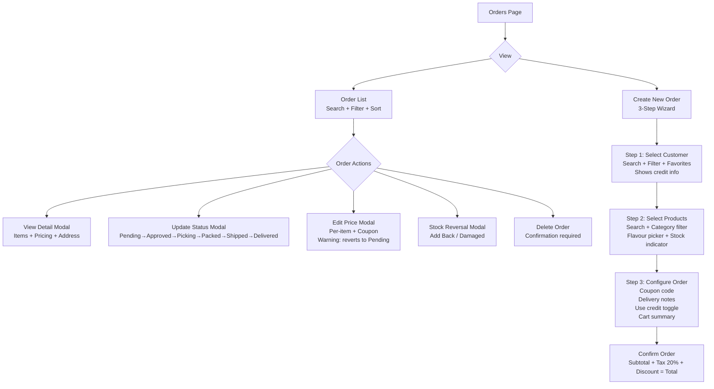
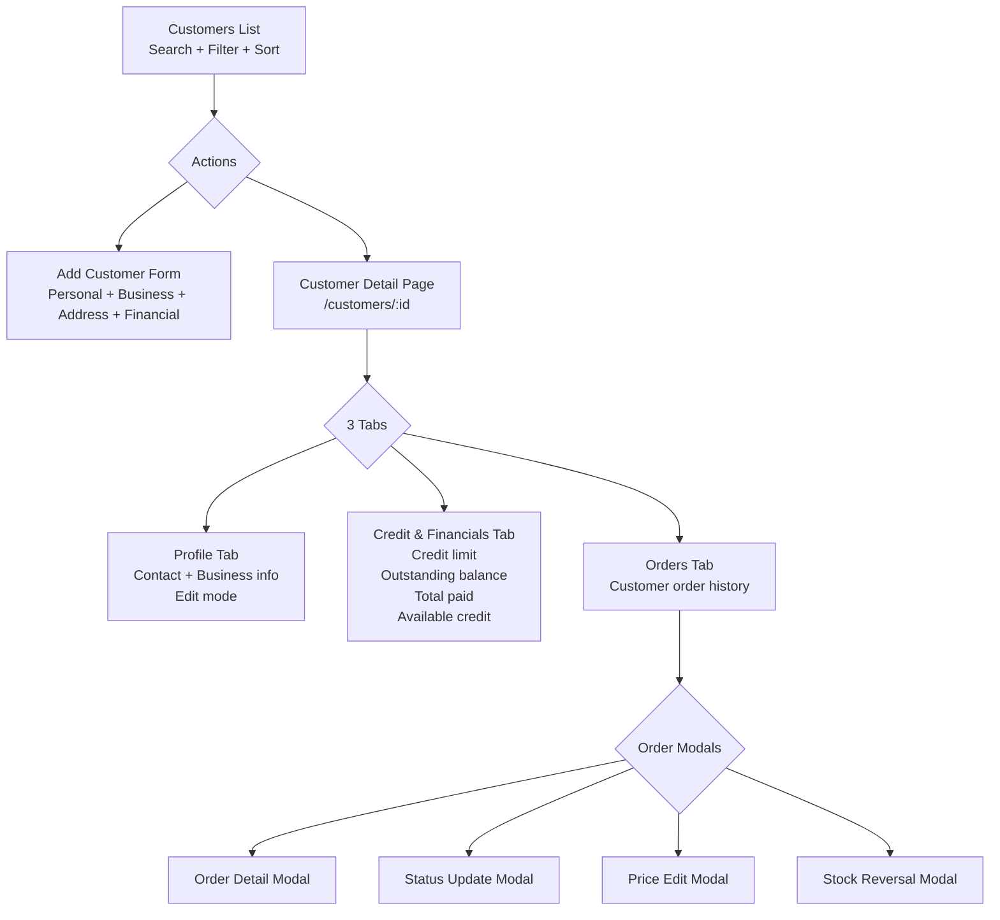
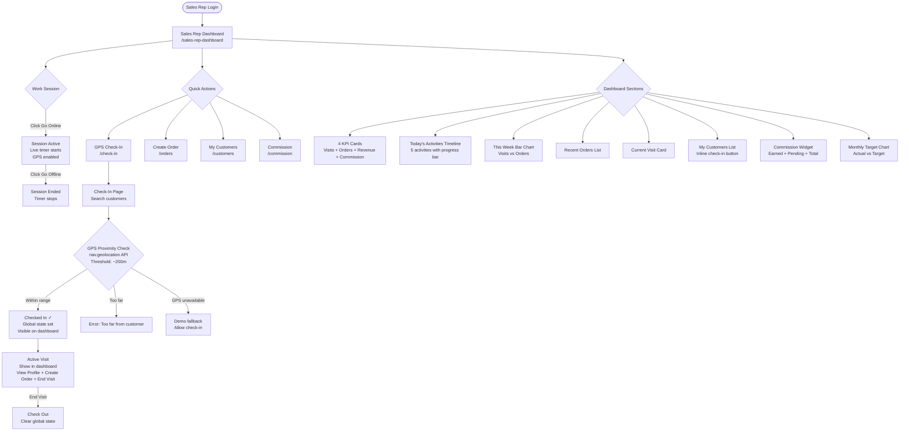
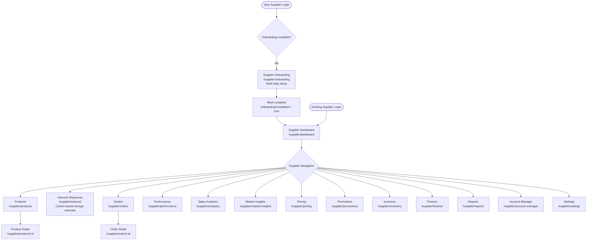
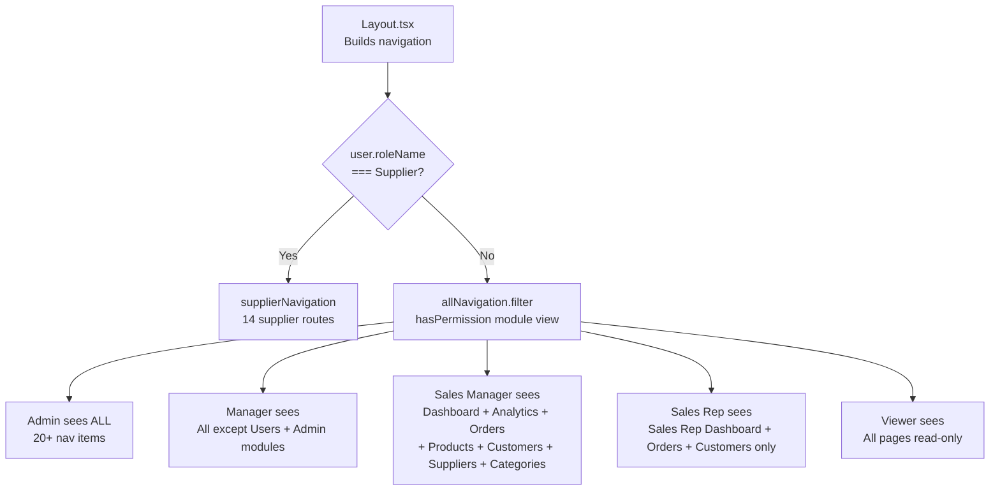
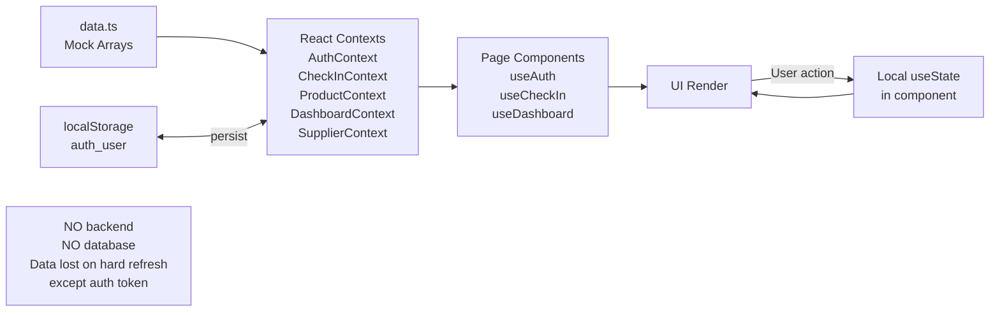

# FBU Admin — Complete Application Flowchart

> Render this file in any Mermaid-compatible viewer:
> - GitHub / GitLab (paste into .md file)
> - https://mermaid.live (paste diagram code)
> - VS Code with Mermaid Preview extension
> - Notion (paste as code block, select Mermaid)

---

## 1. Authentication & Role Routing

```mermaid
flowchart TD
    START([User visits app]) --> HASH{Hash route?}
    HASH -->|/#/login| LOGIN[Login Page]
    HASH -->|/#/supplier/login| SLOGIN[Supplier Login Page]
    HASH -->|Any other route| AUTHCHECK{Authenticated?}
    AUTHCHECK -->|No| LOGIN
    AUTHCHECK -->|Yes| ROLECHECK

    LOGIN --> CREDS[Enter email + password]
    CREDS --> VALIDATE{Match in USERS array?}
    VALIDATE -->|No| ERR[Show: Invalid email or password]
    ERR --> CREDS
    VALIDATE -->|Yes| STATUSCHECK{Account status?}
    STATUSCHECK -->|Suspended| SERR[Show: Account suspended]
    STATUSCHECK -->|Active| ROLECHECK

    SLOGIN --> SCREDS[Enter supplier credentials]
    SCREDS --> SVALIDATE{Valid supplier?}
    SVALIDATE -->|No| SERR2[Show error]
    SVALIDATE -->|Yes| ROLECHECK

    ROLECHECK{Check roleName}
    ROLECHECK -->|Supplier + onboarding incomplete| ONBOARD[/supplier/onboarding]
    ROLECHECK -->|Supplier + onboarding complete| SDASH[/supplier/dashboard]
    ROLECHECK -->|Sales Rep| REPDASH[/sales-rep-dashboard]
    ROLECHECK -->|Admin / Manager / Sales Manager / Viewer| MAINDASH[/ Main Dashboard]
```

---

## 2. Admin / Manager Flow

```mermaid
flowchart TD
    MAINDASH[Main Dashboard\nOperational Control Center] --> ADMINNAV{Navigation}

    ADMINNAV --> ANALYTICS[/analytics\nAnalytics]
    ADMINNAV --> REPPERF[/rep-performance\nRep Performance]
    ADMINNAV --> ORDERS[/orders\nOrders]
    ADMINNAV --> PRODUCTS[/products\nProducts]
    ADMINNAV --> SUPPLIERS[/suppliers\nSuppliers]
    ADMINNAV --> CATEGORIES[/categories\nCategories]
    ADMINNAV --> CUSTOMERS[/customers\nCustomers]
    ADMINNAV --> MARKETING[/marketing\nMarketing]
    ADMINNAV --> COUPONS[/coupons\nCoupons]
    ADMINNAV --> LOYALTY[/loyalty\nLoyalty Program]
    ADMINNAV --> PRICING[/pricing\nPricing Tiers]
    ADMINNAV --> INVENTORY[/inventory\nInventory]
    ADMINNAV --> STOCKREV[/stock-reversal-ledger\nStock Reversals]
    ADMINNAV --> USERS[/users\nUsers]
    ADMINNAV --> ROLES[/roles\nRoles & Permissions]
    ADMINNAV --> ADMIN[/admin\nAdministration]
    ADMINNAV --> CARTS[/active-carts\nActive Carts]

    MAINDASH --> DASHTABS{Dashboard Tabs}
    DASHTABS --> OVERVIEW[Overview\nKPIs + Charts]
    DASHTABS --> SALESREPS[Sales Representatives\nRep table]
    DASHTABS --> LEDGER[Customer Ledger\nBalance ranking]
```

---

## 3. Orders Flow



---

## 4. Customer Management Flow



---

## 5. Sales Rep Flow



---

## 6. Supplier Portal Flow



---

## 7. Permission-Based Navigation



---

## 8. Data Flow (Current — Mock Only)



---

## 9. Complete Route Map

```mermaid
flowchart TD
    ROOT([App Root]) --> PUBLIC[Public Routes]
    ROOT --> PROTECTED[Protected Routes\nwrapped in Layout + Auth]

    PUBLIC --> PL[/#/login]
    PUBLIC --> PSL[/#/supplier/login]
    PUBLIC --> PSO[/#/supplier/onboarding]

    PROTECTED --> MAIN[Main]
    PROTECTED --> ANALYTICS2[Analytics]
    PROTECTED --> SALES[Sales]
    PROTECTED --> CATALOG[Catalog]
    PROTECTED --> CRM[CRM]
    PROTECTED --> COMMERCE[Commerce]
    PROTECTED --> ADMINGRP[Admin]
    PROTECTED --> SUPPLIERGRP[Supplier Portal]

    MAIN --> R1[/#/\nMain Dashboard]
    MAIN --> R2[/#/sales-rep-dashboard\nSales Rep Dashboard]

    ANALYTICS2 --> R3[/#/analytics]
    ANALYTICS2 --> R4[/#/rep-performance]

    SALES --> R5[/#/orders]
    SALES --> R6[/#/active-carts]
    SALES --> R7[/#/check-in]
    SALES --> R8[/#/commission]
    SALES --> R9[/#/stock-reversal-ledger]

    CATALOG --> R10[/#/products]
    CATALOG --> R11[/#/inventory]
    CATALOG --> R12[/#/suppliers]
    CATALOG --> R13[/#/categories]

    CRM --> R14[/#/customers]
    CRM --> R15[/#/customers/:id]
    CRM --> R16[/#/customers/:id/edit]

    COMMERCE --> R17[/#/coupons]
    COMMERCE --> R18[/#/pricing]
    COMMERCE --> R19[/#/marketing]
    COMMERCE --> R20[/#/loyalty]

    ADMINGRP --> R21[/#/users]
    ADMINGRP --> R22[/#/roles]
    ADMINGRP --> R23[/#/admin]

    SUPPLIERGRP --> RS1[/#/supplier/dashboard]
    SUPPLIERGRP --> RS2[/#/supplier/products]
    SUPPLIERGRP --> RS3[/#/supplier/products/:id]
    SUPPLIERGRP --> RS4[/#/supplier/inbound]
    SUPPLIERGRP --> RS5[/#/supplier/inventory]
    SUPPLIERGRP --> RS6[/#/supplier/orders]
    SUPPLIERGRP --> RS7[/#/supplier/orders/:id]
    SUPPLIERGRP --> RS8[/#/supplier/finance]
    SUPPLIERGRP --> RS9[/#/supplier/performance]
    SUPPLIERGRP --> RS10[/#/supplier/analytics]
    SUPPLIERGRP --> RS11[/#/supplier/market-insights]
    SUPPLIERGRP --> RS12[/#/supplier/pricing]
    SUPPLIERGRP --> RS13[/#/supplier/promotions]
    SUPPLIERGRP --> RS14[/#/supplier/reports]
    SUPPLIERGRP --> RS15[/#/supplier/account-manager]
    SUPPLIERGRP --> RS16[/#/supplier/settings]
```
